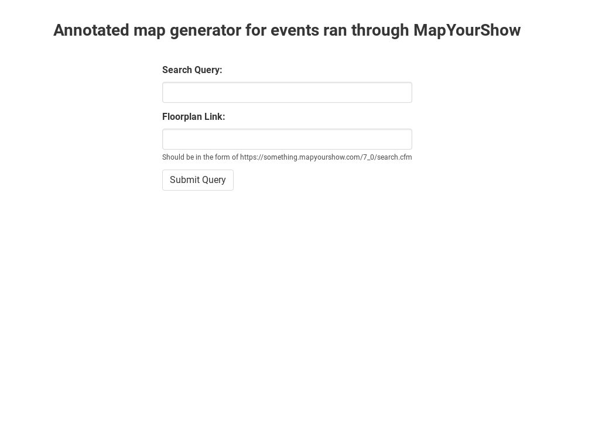
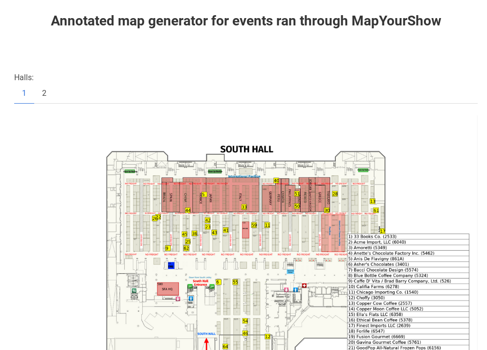

# mys-map-generator  
  
This project is a webapp that creates annotated images of floorplans of tradeshows scraped from MapYourShow.  
Examples include CES and the annual Fancy Food Shows, as well as others.
  
# Running  
  
Running the app requires
* Python 3, with the following libraries:
	* Selenium
		* Geckodriver must be installed and located on `$PATH`
	* Pillow 

First, run `yarn` in both the client and server directories.  
Next, run `yarn start` from the main directory.
You can access it at `localhost:3000`.
  

# Screenshots
  

